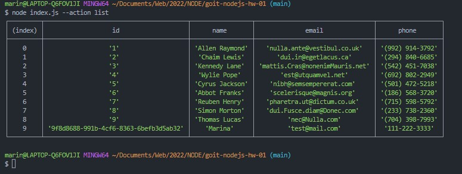
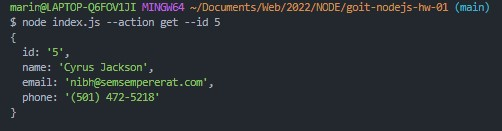
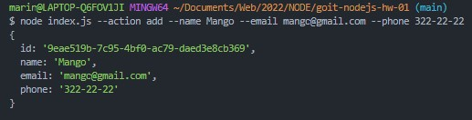
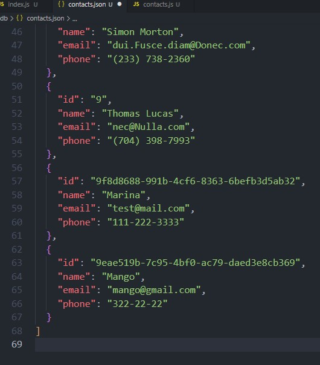
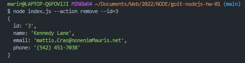
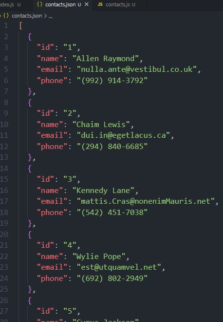
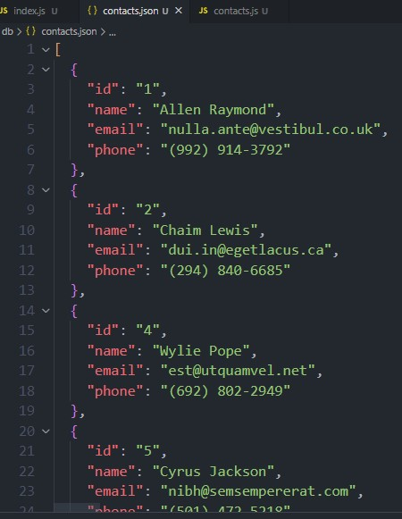
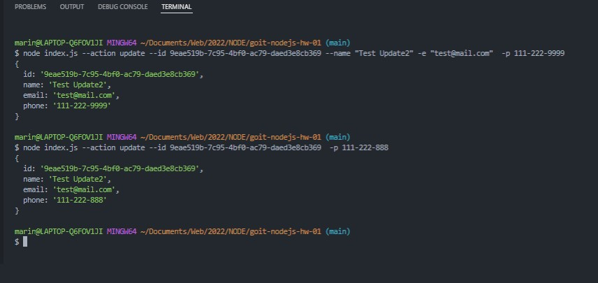

# goit-nodejs-hw-01

### command-list: node index.js --action list

### command-get: node index.js --action get --id 5

### command-add: node index.js --action add --name Mango --email mango@gmail.com --phone 322-22-22

#### add a contact in contacts.json

### command-remove: node index.js --action remove --id=3

#### file contacts.json before remove:

#### file contacts.json after remove:

### command-update: node index.js --action update --id 9eae519b-7c95-4bf0-ac79-daed3e8cb369 -p 111-222-888

